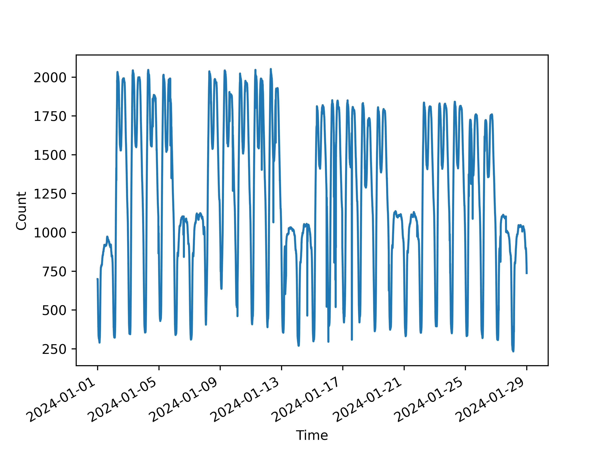
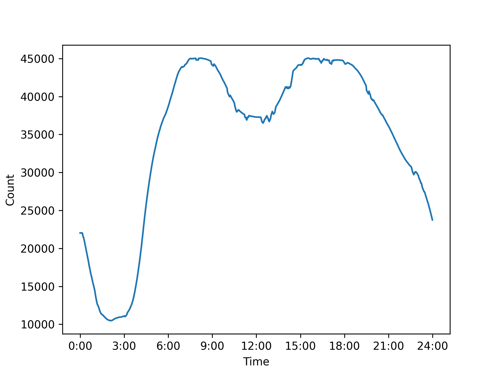
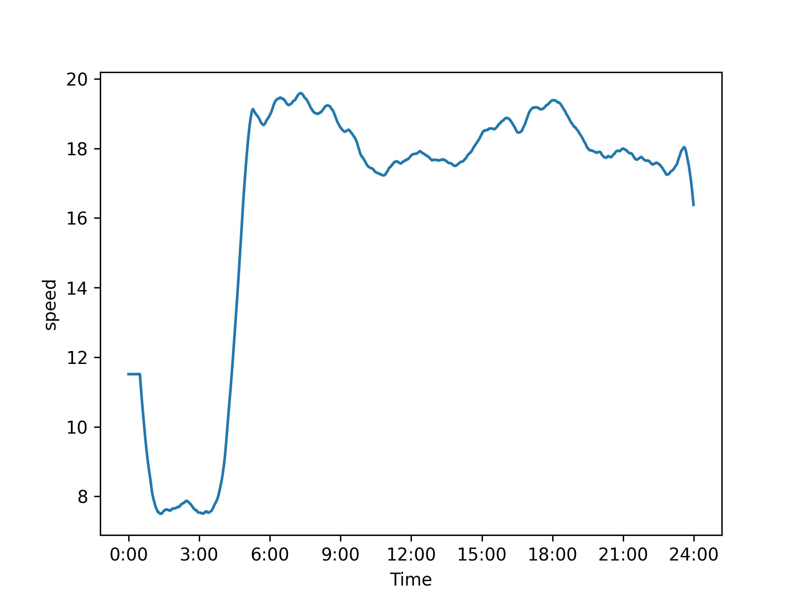
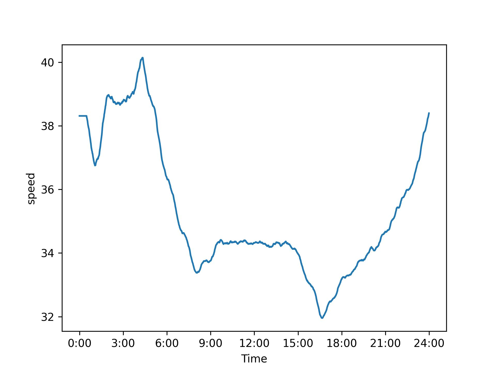
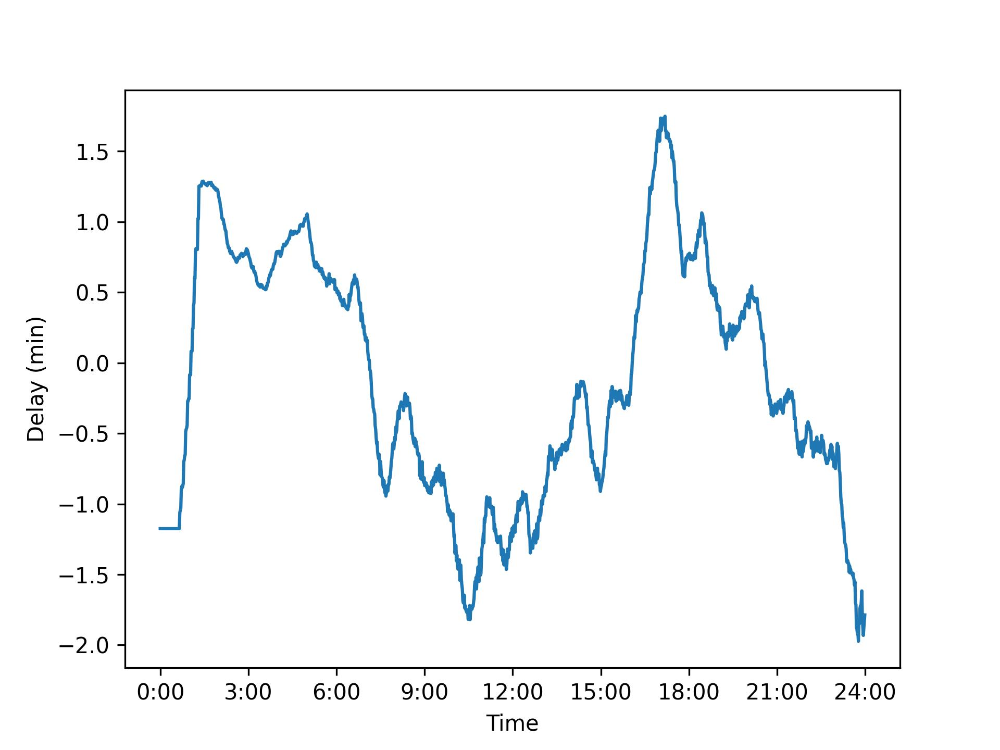
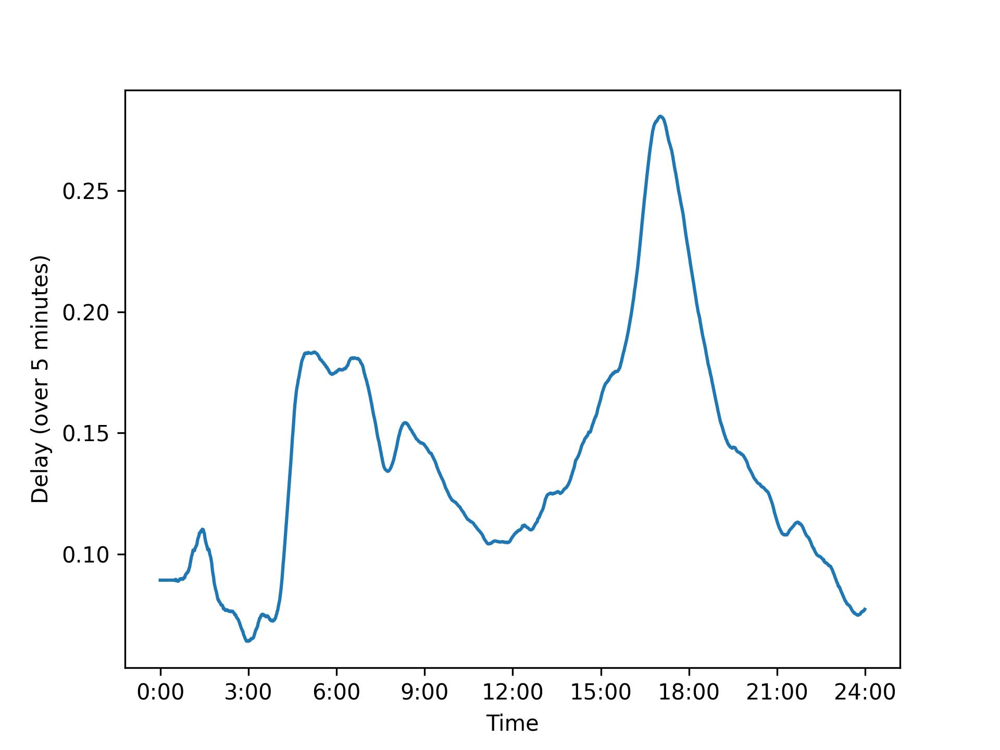

# Transport analyzer — analiza transportu publicznego w Warszawie

### Stanisław Czech.

## Pozyskanie danych

### Pobieranie danych

Prosty skrypt który, który co 6 sekund pobiera lokalizację autobusów i tramwajów
oraz raz dziennie pełny rozkład jazdy.
Pobrane dane zapisuje do lokalnie postawionej bazy danych MongoDB.
Ze względu na ograniczenia pythona,
nie ma możliwości sprawdzenia, czy lokalizacja każdego z pojazdów jest już w zbiorze danych,
w związku z tym baza danych zawiera zduplikowane dane.

Łącznie zebrałem 113GB danych, z czego 104GB to lokalizacja pojazdów,
a reszta to rozkład jazdy.

### Przesyłanie danych

Dane pobierałem na serwerze, a przetwarzałem na laptopie,
musiałem je przekopiować między komputerami.
Ze względy na ograniczenie w prędkości uploadu danych dla domowych sieci WI-FI,
przesyłanie danych trwało 13h przy średniej prędkości ok. 2.4 MB/s

## Przetwarzanie rozkładu jazdy

### Podział na części i uzupełnienie danych

Każdy wiersz rozkładu jazdy zawiera listę wszystkich odjazdów dla wybranej linii i przystanku. Skrypt wyczytuje wiersz po wierszu, a następnie każdy informację o każdym odjeździe uzupełnia o informacje o przystanku (w tym jego lokalizację), a następnie zapisuje każdy odjazd jako pojedynczy wiersz w odpowiedniej części.
Co więcej, każdy wiersz oryginalnego rozkładu jazdy zawiera timestamp, w którym został pobrany. Na tej podstawie dodawana jest data dla każdego odjazdu. 
Jedna część zawiera wszystkie odjazdy pojazdów o określonym numerze brygadowym w obrębie danej linii. 

### 27.31

Rozkład jazdy zawiera godziny odjazdu z zakresu 4.00 do 27.59. W związku z tym godziny odjazdu po 23.59 są traktowane jako odjazdy w kolejnym dniu (z godziną odjazdu modulo 24)

## Przetwarzanie danych lokalizacyjnych

### Podział na części

Ze względu na wielkość danych, nie można wczytać wszystkich danych bezpośrednio do RAM-u
(a wykorzystywanie SWAP-u jest wyjątkowo niestabilne),
podzieliłem dane lokalizacji pojazdów na części.
Jedna część zawiera lokalizacje danego pojazdu jeżdżących w obrębie danej linii.
Każda część jest jednym oddzielnym plikiem.

### Dzielenie na części

Pojedyńczy wiersz z bazy danych to jeden wiersz w pliku wyjściowym.
Skrypt wczytuje dane z głównego pliku linia po linii, a następnie zapisuje dany wiersz do odpowiedniego pliku.
Doprowadza to do sytuacji, w której otwartych jest dużo plików. Uruchomienie skryptu w terminalu powoduje przekroczenie
limitu file deskryptorów. Nie jest to problemem podczas uruchamiania skryptu w pycharm-ie, więc aby ograniczyć narzut
czasowy związany z ciągłym otwieraniem i zamykaniem plików, pozostawiłem tę część rozwiązania w takim stanie.

### Oczyszczanie części

Po podzieleniu całego pliku z lokalizacjami skrypt czyści każdą z części pojedynczo. Wczytuje on każdy wiersz z danej
części, usuwa wszystkie wiersze zawierające tę samą datę, sortuje wszystkie wiersze po dacie. Po wzbogaceniu tych danych
zapisuje je z powrotem do pliku.

### Wzbogacanie danych

---

### Prędkości pojazdów

Dla każdej lokalizacji pojazdu, gdzie poprzednia lokalizacja w obrębie danej części
jest nie dłużej niż 60 sekund od rozpatrywanej, jest wyliczana prędkość. Wiersze, dla których nie istnieje poprzedzający spełniający ww. warunek, są uważane za nieaktywne i nie mają one wyliczanej prędkości. Brana jest różnica w położeniu pojazdu oraz
czasie między obecnym a poprzednim wierszem, a następnie jest wyliczana prędkość (w km/h)

#### Super szybkie autobusy

Jako że GPS, na podstawie którego jest liczona pozycja, a w konsekwencji prędkość pojazdu, nie jest w pełni dokładna,
doprowadza to do sytuacji, gdzie niektóre pojazdy mają nierealnie duże prędkości. Rekordzista poruszał się z prędkością
ponad 800 km/h. W związku z wiersze, dla których prędkość jest większa niż 160 km/h są uważane za nieaktywne, wskutek czego nie posiadają atrybutu prędkości. 

### parser.parse

Podczas testowania skryptu, funkcja parser.parse, odpowiedzialna za parsowanie string-a z datą na obiekt daty, odpowiadała za 75% czasu wykonania. Aby przyspieszyć działąnie skryptu do bardziej akceptowalnego czasu działania, cachuję wyniki działania tej funkcji, co przyspieszyło działanie skryptu ok. 4-5 krotnie.

### 2023-122-30

Dane udostępniane zawierałą pewne nieprawidłowości, między innymi daty o niepoprawnym formacie. Z tego powodu, każdego pojedyńczy rekordu jest owinięta w klauzurę try-catch, aby dowolne błędy nie powodowały przetwarzania pozostałych, prawidłowych danych.   

### Uzupełnianie o rozkład jazdy

Dla każdego pojazdu skrypt określa które odjazdy z przystanków dotyczą danego pojazdu. Abo to określić, skrypt czyta każdą z części rozkładu, która dotyczy rozważanego fragmentu danych. Jako że każdy fragment to para numer pojazdu i numer linii, to pesymistyczne takie rozwiązanie będzie działało w O (l_części * liczba_numerów_brygadowych_dla_1_linii * wielkość_części).

Rozważając rozkład jazdy, skrypt weźmie tylko te odjazdy, dla których pojazd był aktywny w okresie 2 minut od czasu danego odjazdu. Dla każdej części tworzy oddzielny plik z oczekiwanymi czasami odjazdu   

### Rzeczywisty czas odjazdu

Rzeczywisty czas odjazdu jest określany w następujący sposób:

Rozważana jest każda lokalizacja pojazdu w chronologicznej kolejności. Dla każdej lokalizacji wykonywane są następujące kroki
- Odjazdy, do których jest nie więcej niż 5 minut są dodawane do puli oczekiwanych przystanków
- Dla każdego odjazdu w puli aktywnej puli sprawdzana jest odległość między pojazdem a przystankiem. Jeśli jest mniejsza niż dotychczas zarejestrowana (początkowo 600 metrów), jest to aktualizowane wraz z obecnym czasem.
- Jeśli odległość od przystanku jest większa niż 600 metrów, a zarejestrowana jest mniejsza odległość od przystanku, czas, w którym została zarejestrowana minimalna odległość, jest uznawana za rzeczywisty czas odjazdu. Taki odjazd jest usuwany z puli aktywnych przystanków.
- Jeśli dla danego odjazdu minęło już ponad 60 minut od czasu odjazdu, taki przystanek również jest usuwany z aktywnej puli i jest traktowany jako odjazd, który nigdy nie nastąpił.

## Analiza danych

### Liczba aktywnych pojazdów

Wykresy ``daily_activity`` oraz  ``hourly_activity`` zawierają liczbę aktywnych pojazdów odpowiednio dla każdego dnia oraz dla skumulowane dane z wszystkich dni z podziałem na godziny. 

Dla dni powszednich widać największą liczbę aktywnych pojazdów między godziną 6 a 9 oraz 15-19. Natomiast między 1 a 3 jest najmniejsza liczba aktywnych pojazdów.

Na podstawie tego wykresu, można stwierdzić, że zarówno w sobotę, jak i niedzielę komunikacja kursowała z podobną częstotliwością. Co więcej, w weekendy, nie ma skoków liczby aktywnych pojazdów w godzinach szczytu, ale jest ona, mniej więcej równa przez cały dzień.  
 
W okresie 15 - 28 w Warszawie były ferie szkolne. Można w tym czasie zauważyć ~10% spadek liczby aktywnych pojazdów w dni powszednie, natomiast w weekendy liczba kursujących pojazdów pozostała bez zmian.

### Zakres działania komunikacji

Mapa przedstawiająca wszystkie zarejestrowane lokalizacje pokazująca zakres operowania komunikacji miejskiej (skala logarytmiczna)

[Mapa](./res/basic_map.html)

### Średnia prędkość

Wykres ``avg_speed_0`` przedstawia średnią prędkość wszystkich aktywnych pojazdów z podziałem na godziny.

Wykres ``avg_speed_5`` uwzględnia tylko te momenty, w których pojazd poruszał się z prędkością >= 5 km/h 

(wartości przedstawione na obu wykresach są uśrednione na przedziale 30 minut).

Wykres ``avg_speed_5`` można dość prosto zinterpretować:
W nocy jest najmniejszy ruch, więc pojazdy mogą jeździć szybciej.
Natomiast w godzinach szczytu jest największy ruch, w związku z czym średnia prędkość jest najmniejsza.

Wykres ``avg_speed_5`` można uzasadnić w następujący sposób:
W nocy autobusy stoją długo na pętlach, w związku z czym średnia prędkość jest znacząco zaniżona. Natomiast w godzinach szczytu pojazdy praktycznie nie stoją na pętlach. 

### Opóźnienia

Wykres ``avg_delay`` przedstawia średnie opóźnienie ze względu na godzinę.

Wykres ``delay_over_5`` przedstawia procent wszystkich odjazdów z opóźnieniem ponad 5 minut.

Zgodnie z oczekiwaniami największe opóźnienia są godzinach szczytu, jednak w popołudniowym szczycie są one nieproporcjonalnie większe.

### Przekraczanie prędkości

Mapa przedstawiająca wszystkie miejsca, w których pojazdy komunikacji miejskiej przekroczyły odpowiednio prędkości 50 km/h oraz 70 km/h. Można z tego zaobserwować, że najwięcej pojazdów jechało szybciej niż na mostach:
Łaźienkowskim, Poniatowskim, Śląsko-Dąbrowskim, Gdańskim, gen. Stefana Grota-Roweckiego i im. Marii Skłodowskiej-Curie. 
Także na drogach ekspresowych i tych miejscach, gdzie jest większe ograniczenie prędkości, można zaobserwować sporą liczbę autobusów jadących ponad 70 km/h

Ze względu na dokładność przy obliczaniu prędkości, mapa pokazująca miejsca, gdzie autobusy jechały ponad 70 km/h przedstawia Nieco ciekawsze informacje do analizy niż mapa z prędkościami powyżej 50 km/h.

[Mapa 50](./res/speed_map_50.html)

[Mapa 70](./res/speed_map_70.html)

### UWAGA!

Wspomniane obserwacje są jedynie hipotezami bazującymi na przedstawionych danych i osobistych doświadczeniach. Aby potwierdzić (lub zaprzeczyć) tym stwierdzeniom, trzeba by dokonać dodatkowej analizy danych.

## Analiza kodu

### Profiler

Profiler był uruchomiony tylko na 1.5 GB danych lokalizacyjnych i rozkładzie tylko dla 1 stycznia.

28% czasu zajęło parsowanie danych z JSON-a do pythonowego obiektu. 
18% czasu wykonania zajął zapis do plików: funkcja add_line.
10%: czytanie danych z pliku
3%: działanie funkcji parser.parse z cachowaniem (w porównaniu do 70% bez cachowania)

94% Czasu zajęło przetworzenie danych, z czego przetworzenie rozkładu jazdy zajęło ~4% czasu działania, wstępne podzielenie na części 30%, a oczyszczenie i wzbogacenie danych: 60%, z czego 10% to przetwarzanie odjazdów z puli aktywnych.

### Uruchamianie skryptu

Skrypt wykorzystuje arparsera. 
Aby uruchomić cały skrypt, należy dodać flagę ``-f``.
Aby uruchomić samo przetwarzanie danych: ``-p``.
Tworzenie wykresów: ``-i``.
Tworzenie map: ``-m``.